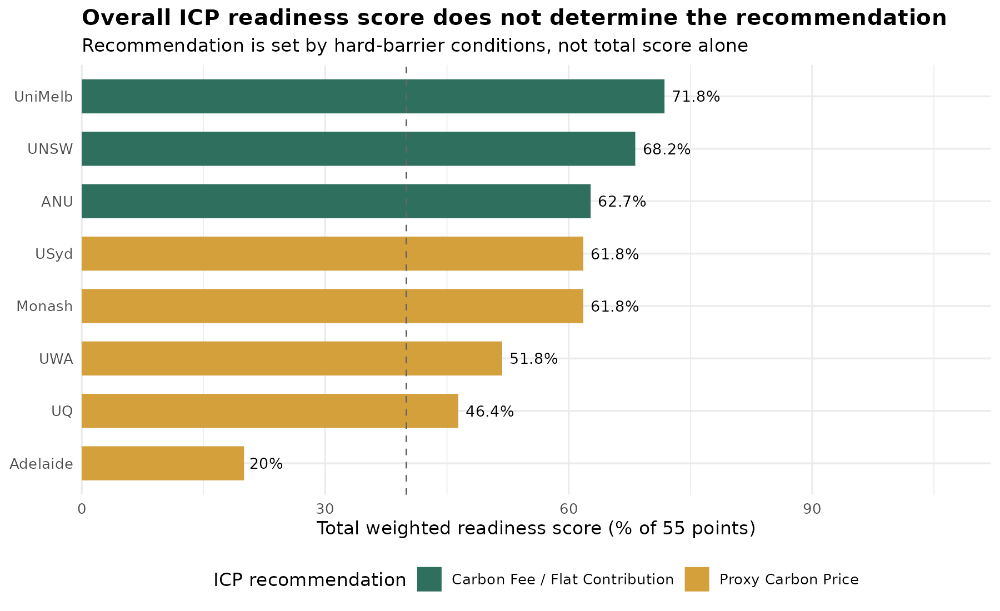
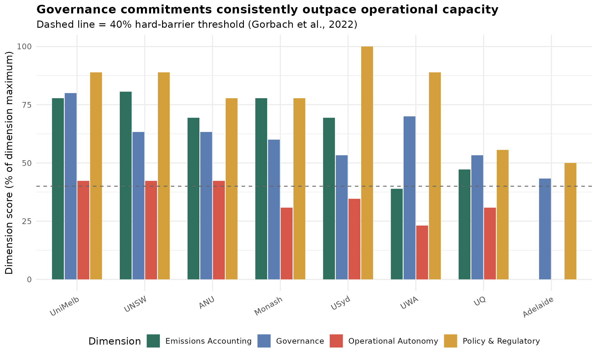
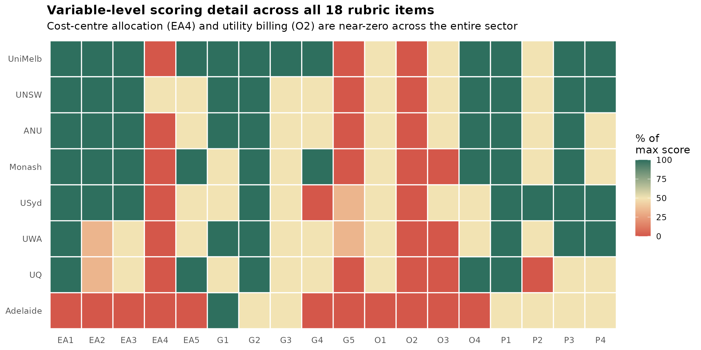

# Internal Carbon Pricing Readiness — Australia's Go8 Universities

**An 18-variable institutional readiness assessment of whether Australia's eight
Group of Eight universities can implement internal carbon pricing (ICP) to
manage Scope 3 emissions.**

This repo contains the reproducible data analysis behind a full research study
(see `Final_Research_Nabil_M.pdf` for the complete thesis with methodology,
literature review, and 35-source evidence record). It's built from a scoring
rubric I designed and applied to all eight universities' 2024 public
sustainability disclosures, then re-analysed in R for this repo.

## The headline finding

Total readiness scores ranged from **20% (Adelaide) to 72% (UniMelb)** — a
huge spread. But the recommended ICP instrument doesn't track that spread
cleanly. Five universities score in a tight 46–62% band yet land on
completely different recommendations, because **two hard-barrier conditions**
(emissions accounting maturity and operational/budget autonomy, both below
40% threshold) override the overall score whenever they're tripped.



The reason: **no Go8 university bills its departments for utilities or
decentralises its budget.** Without that, a department literally cannot
respond to a carbon price — so a sophisticated carbon fee isn't viable no
matter how good the university's climate governance looks on paper.



That pattern holds at the variable level too — cost-centre emissions
allocation (EA4) and utility billing (O2) are scored near-zero across every
single university in the dataset, while governance and policy variables are
consistently strong:



## Repo structure

```
.
├── data/
│   ├── go8_icp_raw_scores.csv          # raw input: 18 variables x 8 universities
│   ├── go8_icp_results_summary.csv     # computed totals + ICP recommendation
│   └── go8_icp_dimension_scores.csv    # dimension-level rollup
├── analysis/
│   └── icp_readiness_analysis.R        # full analysis script (see below)
├── figures/                            # output charts (PNG)
└── README.md
```

## Method, in brief

- **Data**: publicly disclosed 2024 sustainability reports, GHG inventories,
  and climate action plans for all eight Go8 universities (35 sources total).
- **Scoring**: 18 variables across 4 dimensions (Emissions Accounting,
  Governance, Operational Autonomy, Policy & Regulatory), each weighted
  1.0–2.0 based on how central the literature treats it as a precondition for
  ICP to function. Max weighted score = 55.
- **Allocation logic**: a two-pass process — first check the two hard
  barriers (Gorbach et al., 2022), then assign a method by score band if both
  clear.
- **Tools**: scoring and source coding were done in Excel; this repo
  re-implements the scoring and visualization layer in R for reproducibility
  and to separate "the numbers" from "the writing."

Run it yourself:

```r
# from the repo root
install.packages(c("dplyr", "tidyr", "ggplot2", "forcats"))
source("analysis/icp_readiness_analysis.R")
```

This reproduces every figure in `/figures` and the result tables in `/data`
directly from the raw scores — nothing is hardcoded.

## Full write-up

The complete thesis — abstract, literature review, full methodology,
discussion, limitations, and the full 18-variable evidence record with
citations for every single score — is in [`Final_Research_Nabil_M.pdf`](./Final_Research_Nabil_M.pdf).

## AI Declaration

The Excel-based scoring, data collection, and source coding for this project were conducted independently (see the thesis AI Declaration for detail on that process). The R analysis script, data transformation, and visualizations in this repository were built by me with the assistance of Claude to translate the original Excel-based scoring into a reproducible, version-controlled analysis pipeline. All scoring judgments, weights, and the underlying rubric design are my own work.
